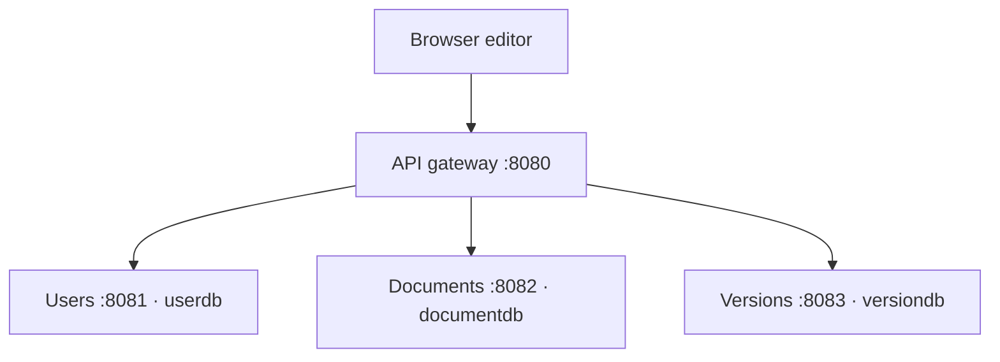

# Collaborative Editing System

[](https://github.com/Manahil-Iftikhar/collaborative-editing-system/actions/workflows/java-checks.yml)
[](https://github.com/Manahil-Iftikhar/collaborative-editing-system/actions/workflows/integration-smoke.yml)

**A Java 17 and Spring Boot learning project for document editing, version snapshots, and service-based backend design.**

The application separates user management, documents, and version history behind a Spring Cloud Gateway. A browser interface demonstrates registration, login, document editing, and snapshot browsing.

> **Status: local development prototype.** Editing uses REST requests. Owner access controls are implemented for user, document, and version APIs. Live synchronization and conflict resolution remain unimplemented. Use sample data only.

## Explore the project

| Component | Port | Responsibility |
| --- | --- | --- |
| [API gateway](api-gateway) | 8080 | Routes the three API prefixes to backend services |
| [User service](user-service) | 8081 | Registration, BCrypt password hashing, login token generation, profiles |
| [Document service](document-service) | 8082 | Document creation, content updates, change records, owner/public listings |
| [Version service](version-service) | 8083 | Content snapshots, history, snapshot-based revert records, contribution counters |
| [Browser editor](collab-editor.html) | Static file | Manual document and version operations through the gateway |
| [API test UI](test-ui.html) | Static file | Small interface for trying selected API operations |

## Architecture



Each backend has its own in-memory H2 database. There is no server-side transaction spanning document updates and version creation. The browser makes separate API calls.

## Start locally

Prerequisites: **JDK 17** and **Maven 3.9+**. The committed POMs specify Spring Boot 3.2.0; the gateway uses Spring Cloud 2023.0.0. These describe the existing project, not a claim of current dependency support.

Set a freshly generated `JWT_SECRET` in the user-service terminal first; see the [configuration instructions](docs/DEVELOPMENT.md#jwt-configuration). There is no built-in signing secret, and the user service refuses missing or short values.

Clone the repository, then run each command in a separate terminal from the repository root:

```bash
mvn -f user-service/pom.xml spring-boot:run
mvn -f document-service/pom.xml spring-boot:run
mvn -f version-service/pom.xml spring-boot:run
mvn -f api-gateway/pom.xml spring-boot:run
```

Open [collab-editor.html](collab-editor.html) from your local checkout in a browser. It calls `http://localhost:8080/api`. See the [development guide](docs/DEVELOPMENT.md) for the demo sequence and troubleshooting.

**Data is temporary:** each backend uses an in-memory database with `create-drop`; restarting it loses its stored data.

## What the implementation demonstrates

- Separation of controllers, DTOs, services, repositories, and persistence models
- REST routing through a gateway
- Registration checks for duplicate usernames and emails
- Password hashing and JWT generation
- Document change records and independently stored version snapshots
- Service tests using Spring Boot and transactional database fixtures
- Automated gateway integration checks using real services, JWTs, and disposable H2 data

## Tests and verification

| Test class | Declared `@Test` methods |
| --- | ---: |
| UserServiceTest | 13 |
| DocumentServiceTest | 12 |
| VersionServiceTest | 14 |
| JwtUtilTest | 5 |
| UserAccessTest | 6 |
| DocumentAccessTest | 5 |
| RemoteIdentityTest | 4 |
| VersionAccessTest | 4 |
| DocumentOwnerAccessTest | 4 |
| VersionConflictTest | 2 |
| VersionConflictHttpTest | 1 |
| DocumentConflictTest | 2 |
| **Total** | **72** |

Verified on **September 27, 2026** at source commit `4fddbf3df3205c82e9cb024942ae630e9dbe3c1b`: [GitHub Actions run 36338681132](https://github.com/Manahil-Iftikhar/collaborative-editing-system/actions/runs/36338681132) completed successfully for all four modules using Java 17 and `mvn clean verify`. The user, document, and version service jobs ran their existing test suites; the gateway job verified its build and has no test class. The table above records declared test methods in source; detailed execution reports are available as workflow artifacts while retained.

[Java checks](https://github.com/Manahil-Iftikhar/collaborative-editing-system/actions/workflows/java-checks.yml) run on pushes and pull requests and retain available Surefire reports for 14 days. Run the suites locally:

```bash
mvn -f user-service/pom.xml test
mvn -f document-service/pom.xml test
mvn -f version-service/pom.xml test
```

### Real-service integration evidence

The separate [gateway integration run 36338681118](https://github.com/Manahil-Iftikhar/collaborative-editing-system/actions/runs/36338681118) passed on **September 27, 2026**, using the same source commit above. It starts all four packaged services with fresh databases and an ephemeral signing secret, then sends real HTTP requests through port 8080.

| Verification layer | What it covers | Evidence |
| --- | --- | --- |
| Java suites | Service behavior, JWT validation, and focused access rules; some upstream responses/access components are mocked | 72 declared test methods; see Java checks for current execution reports |
| Gateway smoke check | Registration/login, private/public reads, owner-only writes and all five version operations, ignored forged actor IDs, snapshot-only revert, and denial during an identity-service outage | Passing real-service integration run linked above |
| Chromium browser smoke | Registration/login, private document create/save/reload, snapshot loading, and cross-account denial through browser CORS | [Passing browser run](https://github.com/Manahil-Iftikhar/collaborative-editing-system/actions/runs/36468441375); [reproduction and scope](docs/BROWSER_TESTING.md) |
| Remaining coverage | Other browsers, exhaustive UI behavior, load testing, automatic text merging and full conflict recovery | Not verified by these workflows |

[Run the integration check locally](docs/DEVELOPMENT.md#gateway-integration-smoke-check) or inspect the [smoke runner](scripts/integration_smoke.py). The integration workflow retains its JSON result and service logs for 14 days. These checks exercise a local sequential workflow; they do not establish production readiness.

The Chromium result above was recorded at source commit `ab09b4d06e2b666f6d561afb75fad960b15d3c20`. It tests one local desktop workflow against real services and does not establish complete browser coverage.

## Current boundaries

- **Editing:** full-content REST updates; no implemented WebSocket handlers, operational transformation, or CRDT synchronization was found.
- **Authorization:** the user service validates bearer tokens and restricts profile reads/updates to the account owner. Document endpoints derive identity from the user service: private reads, owner lists, changes, and all writes are owner-only; public content is readable. All version endpoints require the document owner, including snapshots of public documents. Protected operations deny access if authorization services are unavailable.
- **Versioning:** reverting creates another snapshot in the version service. It does not update the document service's current content.
- **Consistency:** document changes and snapshots are separate operations. A database constraint rejects duplicate snapshot numbers; create/revert return HTTP 409 on integrity conflicts. Reload history before retrying. Document edits require the loaded revision; stale saves return HTTP 409 and missing revisions return 428. Document content and its change record commit atomically. Automatic retries, text merging, and cross-service atomicity are not implemented.
- **Configuration:** JWT signing requires external configuration; H2 consoles are disabled by default; permissive CORS and temporary development databases still require production hardening.

Read [architecture and limitations](docs/ARCHITECTURE.md) before extending or deploying the project.

## Documentation

- [Local setup and demo](docs/DEVELOPMENT.md)
- [Browser smoke test](docs/BROWSER_TESTING.md)
- [API reference](docs/API.md)
- [Architecture and engineering roadmap](docs/ARCHITECTURE.md)

## Academic context

The original README identifies **Manahil Iftikhar** as the student, **Liang Peng** as the professor, and **February 16, 2026** as the submission date. This presentation refresh preserves that context while distinguishing implemented behavior from future goals.

No license file is currently included.
