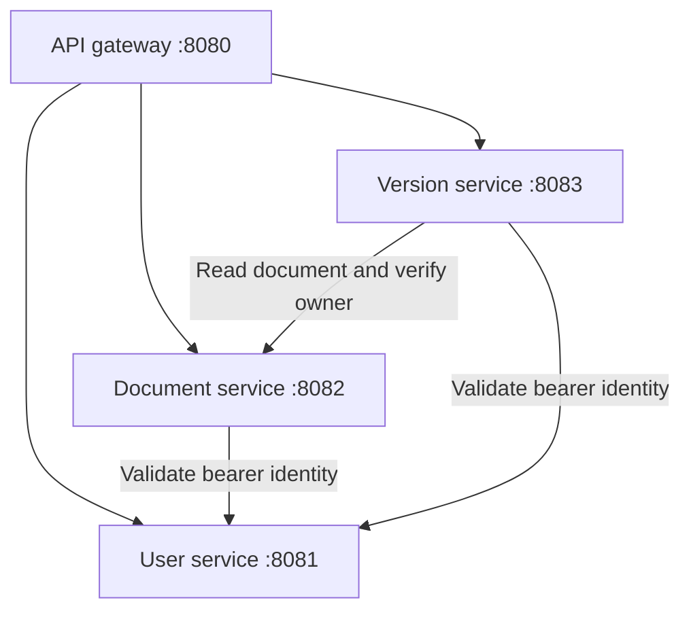

# Architecture and implementation boundaries

## Request flow

The gateway forwards `/api/users/**`, `/api/documents/**`, and `/api/versions/**` to services on ports 8081, 8082, and 8083 respectively. It does not orchestrate a document-and-version transaction.

Each service follows controller → service → repository structure and owns an H2 database. Numeric user/document IDs are supplied across API boundaries; they are not cross-database foreign keys.

## Documents and versions

The document service updates the full content and writes a change record. That history can be retrieved with a GET request; it is not a push stream.

The version service stores snapshots independently and chooses the next version number from the current maximum. A revert copies an earlier snapshot into a new version record. There is no call to update the document service's current content.

Contribution counters are updated when snapshots or revert records are created. They should not be interpreted as verified authorship of every edit or a measure of text written.

## Authentication versus authorization

The user service hashes passwords with BCrypt, generates JWTs at login, and validates bearer tokens on protected requests. Tokens must refer to an existing active account. Profile reads and updates are restricted to the authenticated username, and numeric user lookups are restricted to that account's ID. The editor sends its token when loading the profile. Other user-service routes are denied by default; registration and login POSTs remain public.

This protection is enforced in the user service, including direct calls to port 8081. Document endpoints now call the user service's `/api/users/me` with the bearer token. Owner IDs and editor IDs come from the validated response. Only owners can edit or view private content, owner listings, and change history; public document content remains readable. An unavailable identity service denies protected operations. The version service validates active user identity and document ownership through both services. All version routes are owner-only, including history for public documents. Snapshot creation and revert derive the actor from the authenticated account. Upstream failures deny access. These endpoint controls do not replace production transport, database, or infrastructure hardening.

## Authorization dependencies

The internal calls go directly to configured backend URLs. The document service uses `USER_SERVICE_URL`; the version service also uses `DOCUMENT_SERVICE_URL`. Each client sets three-second connection and read timeouts. A private document lookup from the version service causes the document service to validate identity again. Public content can be read without that document-level check, but the version service still validates the caller and compares the returned owner ID before exposing history.

These synchronous dependencies make authorization availability part of request success: protected requests are denied when required verification cannot complete. The gateway routes requests; it does not replace the backend ownership checks. See [local configuration](DEVELOPMENT.md#document-authorization) and the [real-service smoke runner](../scripts/integration_smoke.py).

## Development configuration

- Separate in-memory H2 stores are reset on service restart.
- H2 browser consoles are disabled by default in all three backend services. The in-memory databases still support the application normally.
- The gateway allows all origins and broad methods/headers.
- JWT signing requires an externally supplied `JWT_SECRET`; missing or short values prevent user-service startup.

Do not use real personal data or expose this configuration as a production service. If the former signing value in Git history was used in a deployment, replace it there before relying on token validation.

## Implemented engineering improvements

| Improvement | Implementation / evidence |
| --- | --- |
| External JWT signing configuration and owner-only user, document, and version APIs | [API reference](API.md) and access-control classes |
| Java builds and focused tests in CI | [Java checks](../.github/workflows/java-checks.yml) |
| Real gateway-to-service authorization checks, including identity-service outage denial | [Integration workflow](../.github/workflows/integration-smoke.yml) and [verification evidence](../README.md#real-service-integration-evidence) |
| Database browser consoles disabled by default | Backend configuration and direct-port console probes in the smoke runner |

## Prioritized engineering roadmap

1. Add browser interaction and CORS tests; extend existing HTTP integration coverage to additional upstream failures.
2. Establish production database/configuration profiles, restricted origins, and protected service transport; review dependency support before deployment.
3. Define reliable document/snapshot coordination and rollback semantics.
4. Add assisted text reconciliation and deliberate snapshot conflict recovery.
5. Define explicit sharing roles and implement a synchronization protocol if simultaneous editing is required.
6. Add broader input validation and consistent error responses.

The roadmap describes remaining work. Existing sequential HTTP checks do not establish browser correctness, concurrent editing, or production readiness.

## Snapshot number collisions

A database unique constraint on `(document_id, version_number)` prevents duplicate snapshot numbers, including competing first snapshots. Allocation still reads MAX + 1: one colliding write can fail, and create/revert map integrity violations to HTTP 409. Snapshot creation and contribution updates share a transaction. Two H2 tests force equal allocation reads in separate concurrent service transactions, then verify one winner and no extra contribution count; a focused MVC test checks both conflict responses. These tests do not establish production database behavior or load capacity. Existing databases would need a migration and duplicate cleanup before adding this constraint; the current H2 setup recreates its schema on startup.

## Document edit consistency

A JPA `@Version` revision guards document updates. The service compares the caller's revision with the loaded entity, then the database update also checks the entity revision to catch simultaneous transactions. Content replacement and change-history insertion share one transaction; a rejected update rolls back both. The response is mapped after flushing so it includes the incremented revision.

Two H2 tests cover stale/missing revisions, deliberate reload/retry, and forced simultaneous managed-entity reads. Gateway checks verify 428/409 and unchanged content/history, while Chromium verifies that a rejected save preserves the local draft. This covers targeted conflicts, not multi-user text merging, load capacity, or a production database. Existing persistent databases need a revision-column migration; the current development database is recreated at startup. Document revisions are independent of snapshot version numbers.
